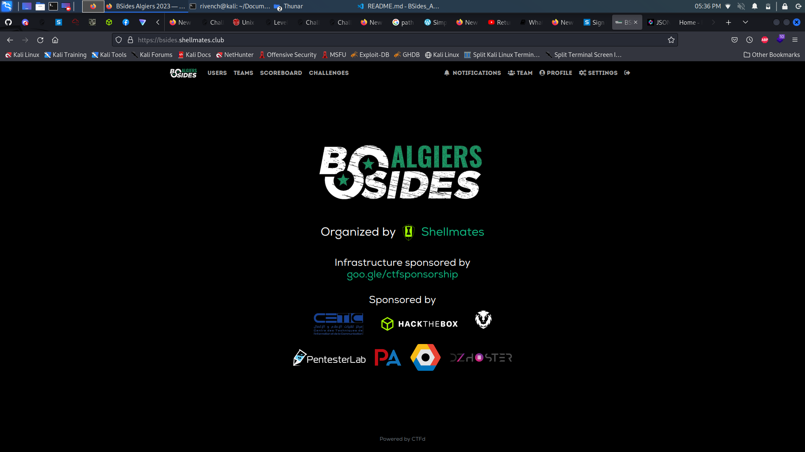

# BSides Algiers 2k23 Write-Ups

Welcome to BSides Algiers 2k23 Challenges' Write-Ups Repository, you can find all detailed solutions of each ctf's challenge.

## Introduction 

BSides is a global non-profit security event orgonized by cybersecurity experts, Shellmates is hosting the Algiers version, including a CTF competition, conferences, and workshops. The event aims to unite Algeria's cybersecurity community. share knowledge and experiences.

## Content

 - [Cryptography](./crypto/)
 - [Hardware](./hardware/)
 - [Web Exploitation](.//web/)
 - [Miscellaneous](./misc/)
