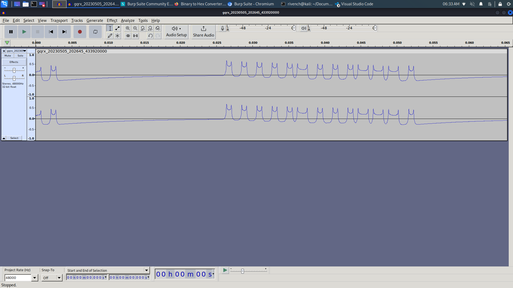

# Waves Catcher 

## Description

> Since the last theft, your neighbor thinks he's safer now with his flo remote key. Prove him wrong... Flag : shellmates{sha1sum(2 interesting bytes)}

## Tags

>  Radio frequencies, onsite 

## Write-Up

After capturing the signal, we can identify it from the following waves :



This looks like a serie of bits `1111101110001`.

In hex it gives us : `1F71`

We calculate the checksum of the two bytes :

```
└─$ echo -n '1F71' | sha1sum
4b9979234e5700574814e94cec9a25b21db049eb  -
```

## Flag

shellmates{4b9979234e5700574814e94cec9a25b21db049eb}

## More Information

 - https://gabor.heja.hu/blog/2020/03/16/receiving-and-decoding-433-mhz-radio-signals-from-wireless-devices/
 - https://forum.audacityteam.org/t/importing-raw-data-getting-only-a-square-signal/64796/4