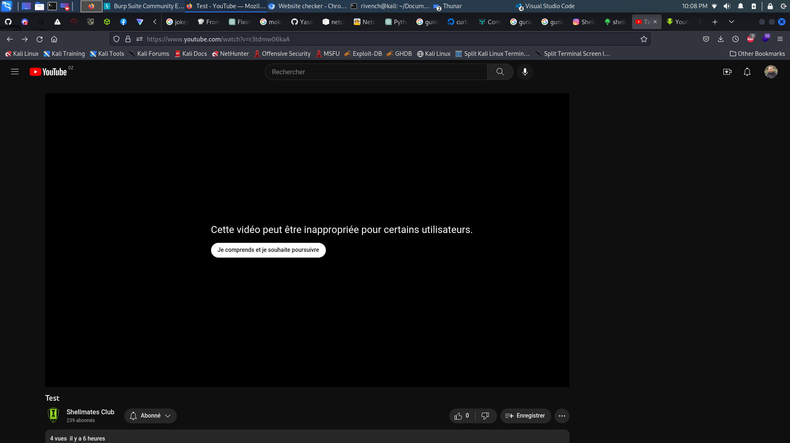

# Storage Issues

## Description

> Our club had some storage issues, but not anymore.
> 
> Idea: Mokr4ne

## Tags

> osint, forensics

## Write-Up

Since we are talking, we check the club's social media and server, we found something interesting in the youtube channel



From there, we download the video and try to find out what does it contain.

Since we are talking about stoage, there is a person that have a github repository, who gives us the opportunity to insert data in a video in a way to ain infinite storage :

https://github.com/DvorakDwarf/Infinite-Storage-Glitch

And here is some articles about it :

https://bootcamp.uxdesign.cc/use-youtube-as-free-cloud-storage-for-any-files-c6cf1a17eeb9
https://hackaday.com/2023/02/21/youtube-as-infinite-file-storage/

First, let's download the vide  using yt-dlp :

repository : https://github.com/yt-dlp/yt-dlp

```
└─$ ls Downloads 
yt-dlp

┌──(rivench㉿kali)-[~]
└─$ chmod +x Downloads/yt-dlp

┌──(rivench㉿kali)-[~]
└─$ sudo mv Downloads/yt-dlp /bin

┌──(rivench㉿kali)-[~]
└─$ ls /bin/yt-dlp 
/bin/yt-dlp

┌──(rivench㉿kali)-[~]
└─$ yt-dlp        

Usage: yt-dlp [OPTIONS] URL [URL...]

yt-dlp: error: You must provide at least one URL.
Type yt-dlp --help to see a list of all options.

```

now we download the video, [Test](./test.mp4)


Second, we build the Infinite-Glitch repository to extract the data from the video :

```
└─$ git clone https://github.com/DvorakDwarf/Infinite-Storage-Glitch

└─$ cd Infinite-Storage-Glitch

└─$ docker build -t isg .

docker run -it --rm -v ${PWD}:/home/Infinite-Storage-Glitch isg cargo build --release
```

That's it. You will find the executable in the `target/release` directory.

Or just use remote Emulation :

```
└─$ docker run -it --rm -v ${PWD}:/home/Infinite-Storage-Glitch isg ./target/release/isg_4real
Emulate Docker CLI using podman. Create /etc/containers/nodocker to quiet msg.
Welcome to ISG (Infinite Storage Glitch)
This tool allows you to turn any file into a compression-resistant video that can be uploaded to YouTube for Infinite Storage:tm:

How to use:
1. Zip all the files you will be uploading
2. Use the embed option on the archive (THE VIDEO WILL BE SEVERAL TIMES LARGER THAN THE FILE, 4x in case of optimal compression resistance preset)
3. Upload the video to your YouTube channel. You probably want to keep it up as unlisted
4. Use the download option to get the video back
5. Use the dislodge option to get your files back from the downloaded video
6. PROFIT

> Pick what you want to do with the program Download
> What is the url to the video ? https://www.youtube.com/watch?v=r3tdmw06kaA
Starting the download, there is no progress bar
Video downloaded successfully
Output path: /home/Infinite-Storage-Glitch/downloaded_2023-05-05_23-28-33.mp4

┌──(rivench㉿kali)-[~/…/BSides_Algiers_2k23/misc/Storage_Issues/Infinite-Storage-Glitch]
└─$ docker run -it --rm -v ${PWD}:/home/Infinite-Storage-Glitch isg ./target/release/isg_4real
Emulate Docker CLI using podman. Create /etc/containers/nodocker to quiet msg.
Welcome to ISG (Infinite Storage Glitch)
This tool allows you to turn any file into a compression-resistant video that can be uploaded to YouTube for Infinite Storage:tm:

How to use:
1. Zip all the files you will be uploading
2. Use the embed option on the archive (THE VIDEO WILL BE SEVERAL TIMES LARGER THAN THE FILE, 4x in case of optimal compression resistance preset)
3. Upload the video to your YouTube channel. You probably want to keep it up as unlisted
4. Use the download option to get the video back
5. Use the dislodge option to get your files back from the downloaded video
6. PROFIT

> Pick what you want to do with the program Dislodge
> What is the path to your video ? /home/Infinite-Storage-Glitch/downloaded_2023-05-05_23-28-33.mp4
> Where should the output go ? /home/Infinite-Storage-Glitch/output_file_flag
Video read successfully
Dislodging frame ended in 240ms
File written successfully
```

From there  :


```
└─$ file output_file_flag                   
output_file_flag: Zip archive data, at least v2.0 to extract, compression method=deflate

┌──(rivench㉿kali)-[~/…/CTFs/BSides_Algiers_2k23/misc/Storage_Issues]
└─$ mv output_file_flag output_file_flag.zip 

┌──(rivench㉿kali)-[~/…/CTFs/BSides_Algiers_2k23/misc/Storage_Issues]
└─$ unzip output_file_flag.zip 
Archive:  output_file_flag.zip
[output_file_flag.zip] flag.pdf password:  
```


Cracking the password :

```
└─$ zip2john output_file_flag.zip > hash_zip
ver 2.0 efh 5455 efh 7875 output_file_flag.zip/flag.pdf PKZIP Encr: TS_chk, cmplen=31155, decmplen=32481, crc=9392B1CF ts=9D01 cs=9d01 type=8

┌──(rivench㉿kali)-[~/…/CTFs/BSides_Algiers_2k23/misc/Storage_Issues]
└─$ john hash_zip      
Using default input encoding: UTF-8
Loaded 1 password hash (PKZIP [32/64])
Will run 12 OpenMP threads
Proceeding with single, rules:Single
Press 'q' or Ctrl-C to abort, almost any other key for status
Almost done: Processing the remaining buffered candidate passwords, if any.
Proceeding with wordlist:/usr/share/john/password.lst
Proceeding with incremental:ASCII
choco            (output_file_flag.zip/flag.pdf)     
1g 0:00:00:00 DONE 3/3 (2023-05-06 00:48) 1.282g/s 360496p/s 360496c/s 360496C/s breasd..153928
Use the "--show" option to display all of the cracked passwords reliably
Session completed. 

┌──(rivench㉿kali)-[~/…/CTFs/BSides_Algiers_2k23/misc/Storage_Issues]
└─$ ls
1.png  hash_zip  Infinite-Storage-Glitch  output_file_flag.zip  solution.md  test.mp4

┌──(rivench㉿kali)-[~/…/CTFs/BSides_Algiers_2k23/misc/Storage_Issues]
└─$ unzip output_file_flag.zip              
Archive:  output_file_flag.zip
[output_file_flag.zip] flag.pdf password: 
  inflating: flag.pdf                

┌──(rivench㉿kali)-[~/…/CTFs/BSides_Algiers_2k23/misc/Storage_Issues]
└─$ ls
1.png  flag.pdf  hash_zip  Infinite-Storage-Glitch  output_file_flag.zip  solution.md  test.mp4

```

from there, we find the flag in the pdf file : shellmates{n0_$pace?_just_UsE_y0utU.BE}

## Flag

shellmates{n0_$pace?_just_UsE_y0utU.BE}